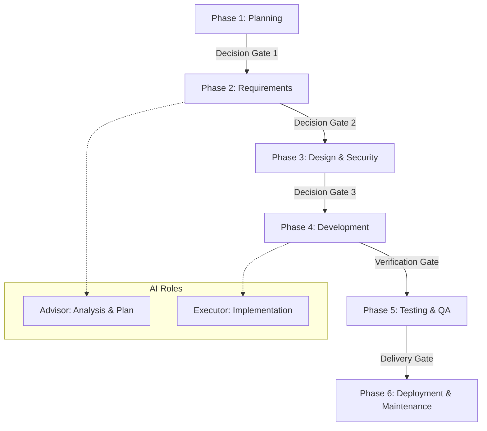

# **SDLC Map (กระบวนการพัฒนามาตรฐาน)**

เอกสารนี้แสดงลำดับขั้นตอน (Workflow) ในการพัฒนาโปรเจกต์ตั้งแต่เริ่มจนจบ

## **รายละเอียดแต่ละระยะ**

### **1. Planning**
- **Input:** ความต้องการจาก Owner (Intent)
- **Output:** Roadmap (03), Work Log (04)
- **Gate:** การอนุมัติ Slice งาน

### **2. Requirements**
- **Input:** Roadmap Slice
- **Output:** Implementation Spec, UI Contract
- **Gate:** การเห็นชอบ Spec (AI-Advisor เป็นผู้ช่วยวิเคราะห์)

### **3. Design & Security**
- **Input:** Approved Spec
- **Output:** DB Migration, API Design, RBAC Rules
- **Gate:** ตรวจสอบความสอดคล้องกับ Permission Policy

### **4. Development**
- **Input:** DB & Design Schema
- **Output:** Code Implementation, Action Log (05)
- **Gate:** Syntax Check (Node/JS Lint)

### **5. Testing & QA**
- **Input:** Code Complete
- **Output:** Smoke Test CSV, Playwright E2E Results
- **Gate:** Verification Gate (Evidence Rule)

### **6. Deployment & Maintenance**
- **Input:** Verified Code
- **Output:** Delivery Report, Knowledge Hub Update (08)
- **Gate:** Post-Release Verification
